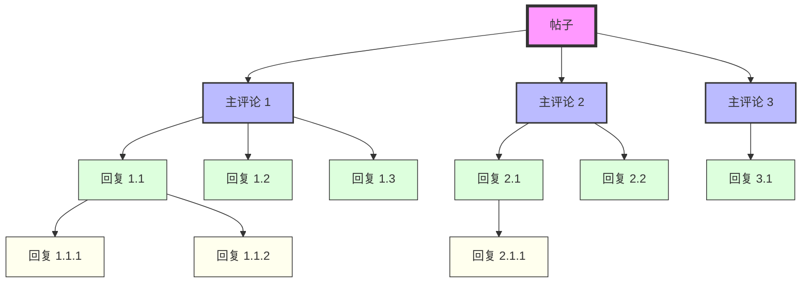

目前的评论系统大多其实都是二级评论，盖楼的那种基本没有了，还有一种是嵌套层级的那种，比如raddit的评论就是这个，但是呢，肯定也是不能的无限嵌套的，不然没有办法显示，如果我😯没有记错的话应该是十层，如果超过十层可能要打开新的页面来显示，不过基本上很少有超过5层的回复，

首先先来讲，二级回复，这种形式的结构是如下这样的

  

    
这是第一个主评论。

    
用户1 · 2小时前 | 回复

    

      

        
这是对主评论1的直接回复。

        
用户2 · 1小时前 | 回复

      

      

        
这是对主评论1的另一个直接回复。

        
用户3 · 30分钟前 | 回复

      

      
加载更多回复...

    

  

  
  

    
这是第二个主评论。

    
用户4 · 3小时前 | 回复

    

      

        
这是对主评论2的回复。

        
用户5 · 2小时前 | 回复

      

    

  

  
  
加载更多评论...

上面的那种结构实际上就是把原来嵌套的评论进行打平，原来的结构大致如下

